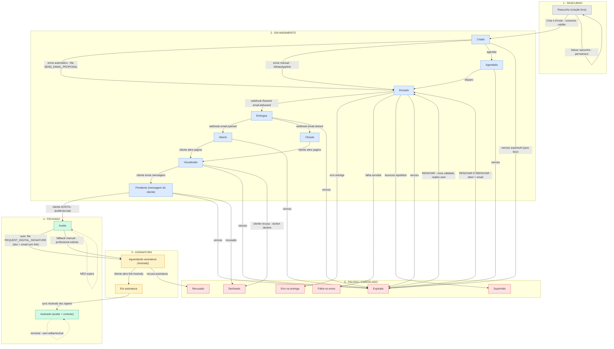
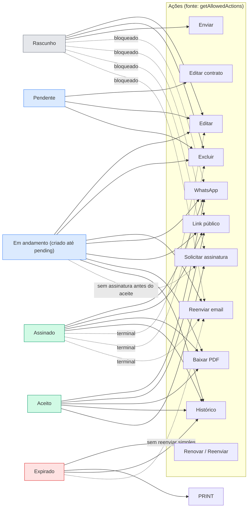
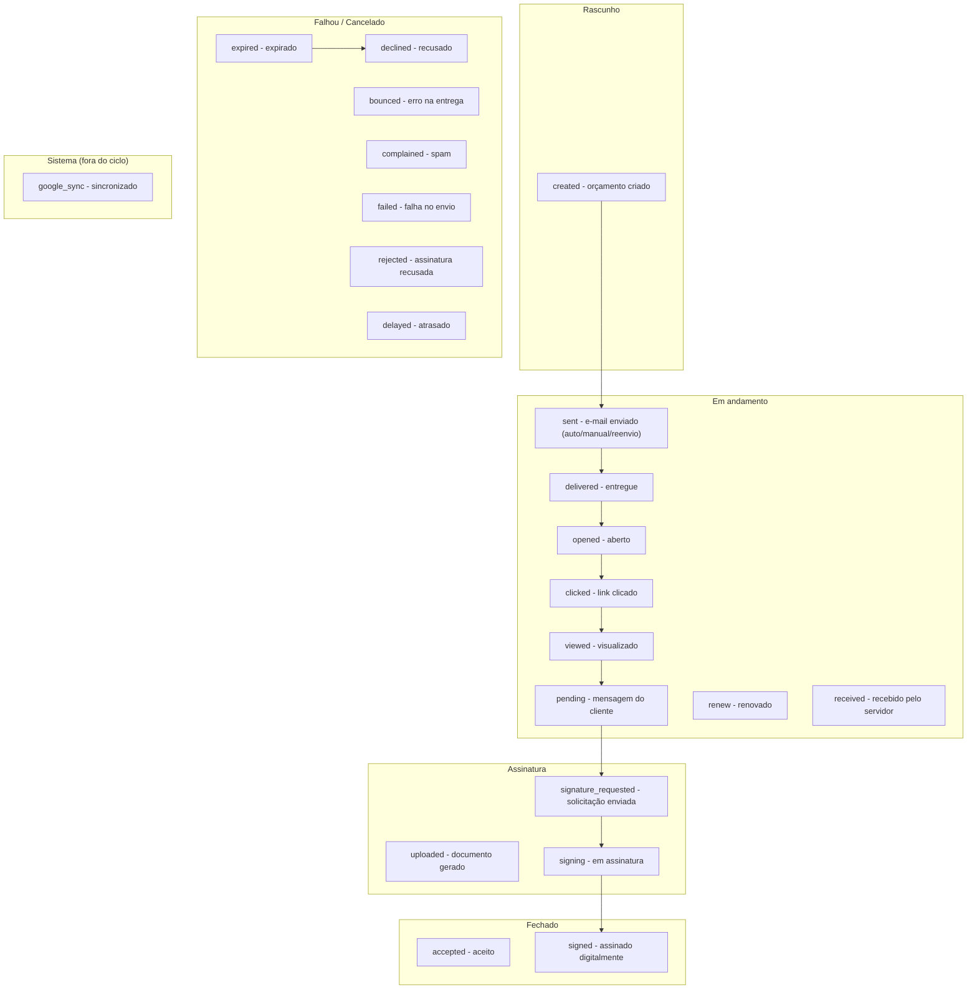

# Ciclo de Vida do Orçamento — Diagramas Mermaid (Orcei)

> Base: código real (`server/services/ProposalService.ts`, endpoints, `app/utils/proposalLifecycle.ts`).
> 19 statuses em **5 fases**: Rascunho → Em andamento → Assinatura → Fechado | Falhou/Cancelado.

---

## 1. Ciclo de vida — transições + gatilhos

---

## 2. Ações permitidas por status (matriz canônica)

---

## 3. Eventos do histórico por fase (agrupamento)

---

## Notas de regra (implementadas)

1. **Aceite primeiro, assinatura depois**: `REQUEST_DIGITAL_SIGNATURE` dispara automaticamente no aceite (`acceptProposal`). Assinar antes do aceite é bloqueado (backend 422 + matriz).
2. **Expirado = status real**: sincronizado lazy em `getById`/listagem → `status: 'expired'` persistido + evento `expired` no histórico.
3. **Aceito/assinado não expira**: imunes em `syncExpiredStatus`, página `/p`, card e matriz.
4. **Renovar/Reenviar**: recalcula validade, reabre `sent`, reenvia email com o mesmo link (`slug` + `token` intactos). Modal com 3 opções (Cancelar / Renovar / Renovar e Reenviar). Expirado não tem botão "Reenviar" simples — só renovar.
5. **Data de validade** conta a partir do envio (rascunho saindo reseta `createdAt` + `expiresAt`).
6. **Histórico ordenado**: etapas de baixo para cima (mais recente no topo), ações dentro da etapa mais recente primeiro.
7. **Stepper**: falha vinda de Em andamento marca só Rascunho + Em andamento como concluídas; Assinatura/Fechado permanecem não concluídas.