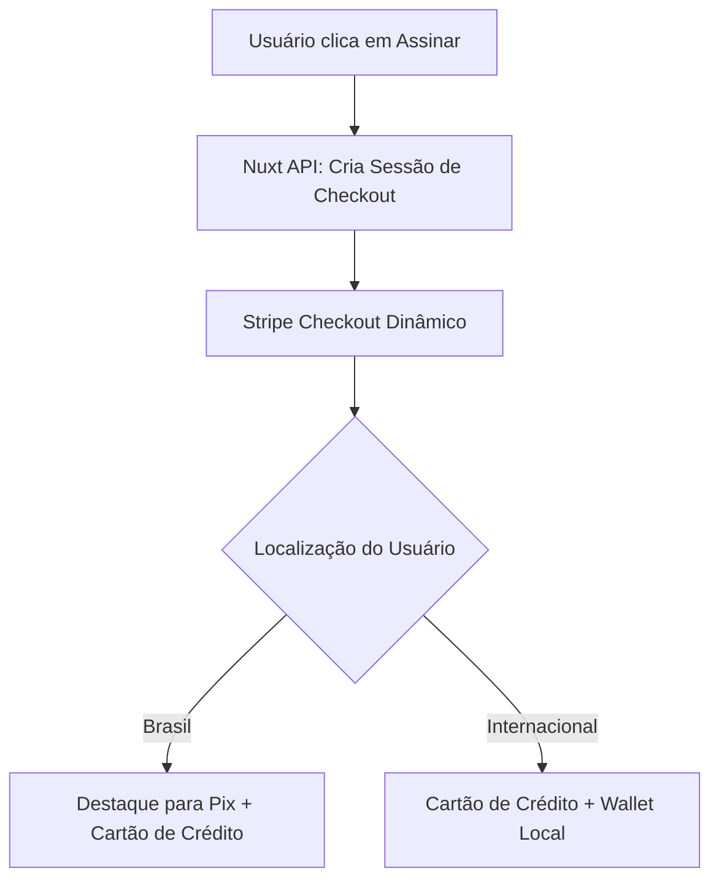

# Relatório Estratégico de Arquitetura de Checkout Stripe
## Otimização de Conversão (CRO) e Experiência de Pagamento para o Orcei Fácil

Este documento apresenta o guia definitivo e as diretrizes arquiteturais para configurar e otimizar a experiência de checkout do **Stripe** no **Orcei Fácil**, com foco total na maximização da conversão de profissionais autônomos e freelancers no mercado brasileiro.

---

## 1. O Perfil de Compra do Freelancer Brasileiro (Psicologia de Conversão)

O freelancer e autônomo brasileiro opera sob restrições severas de tempo e previsibilidade financeira. Ao contratar uma ferramenta de orçamentos e propostas como o Orcei Fácil, sua mentalidade de compra é regida por três pilares fundamentais:
1. **Fricção Imediata é Barreira de Entrada**: Qualquer segundo extra gasto preenchendo campos de cadastro ou formulários de faturamento complexos aumenta a chance de desistência ("Faço isso depois").
2. **Previsibilidade Financeira e Liquidez**: Preferência absoluta por formas de pagamento instantâneas (Pix) e a flexibilidade do Cartão de Crédito para gerir fluxo de caixa.
3. **Consistência de Marca**: O medo de fraudes e golpes na internet faz com que saídas abruptas do design da plataforma para um checkout genérico gerem desconfiança imediata.

Para mitigar esses gargalos, a integração com o Stripe Checkout deve ser cirúrgica. A seguir, detalhamos a configuração otimizada de ponta a ponta.

---

## 2. Métodos de Pagamento em Destaque no Brasil (Pix + Cartão)

O ecossistema brasileiro de pagamentos é único. A combinação de **Cartão de Crédito** e **Pix** cobre mais de 95% do mercado consumidor digital de Micro SaaS.



### 2.1 Preferências Dinâmicas e Gestão via Dashboard

Historicamente, desenvolvedores hardcodavam os métodos de pagamento suportados no backend:
```typescript
// Padrão antigo e engessado (NÃO RECOMENDADO)
payment_method_types: ['card', 'pix']
```
Este método engessado impede que a Stripe aplique algoritmos de machine learning para reordenar os métodos de pagamento baseando-se no dispositivo do usuário (ex: exibir Apple Pay ou Google Pay no topo se o usuário estiver num dispositivo compatível) ou na localização geográfica.

**A Solução Recomendada (Compatibilidade Universal)**:
No arquivo `server/api/stripe/checkout.post.ts`, **omitimos completamente** os parâmetros `payment_method_types` e `automatic_payment_methods`. 

Nas versões de API da Stripe a partir de `2022-08-01`, omitir estes parâmetros faz com que a Stripe Checkout Session utilize automaticamente e por padrão a configuração de métodos de pagamento ativos no seu Stripe Dashboard de forma 100% dinâmica. Isso também evita o erro clássico de incompatibilidade de versão de API da Stripe (`Received unknown parameter: automatic_payment_methods`) em contas ou chaves mais antigas.

```typescript
// Implementação Otimizada e Compatível no Nuxt Backend
const session = await stripe.checkout.sessions.create({
  customer: profile.stripeCustomerId,
  mode: 'subscription', // ou 'payment' para créditos avulsos
  // Omitimos payment_method_types para delegar ao Dashboard da Stripe!
  // ... outras configurações
});
```

### 2.2 Configuração no Stripe Dashboard
Para que essa dinâmica funcione, você deve acessar **Configurações > Métodos de Pagamento** no painel da Stripe e habilitar:
1. **Cartões de Crédito** (Visa, Mastercard, Elo, Amex, Hipercard).
2. **Pix**: A Stripe gera automaticamente o QR Code e o código "Copia e Cola" diretamente na tela de checkout, com conciliação bancária imediata e disparo instantâneo do webhook `checkout.session.completed` em menos de 3 segundos após o pagamento.

> [!IMPORTANT]
> **Atenção ao Pix na Recorrência (Subscriptions)**: 
> No Brasil, assinaturas nativas recorrentes via Pix ainda exigem intervenção manual a cada ciclo de faturamento. Para planos recorrentes (*Starter* e *Premium*), o **Cartão de Crédito** deve ser o método principal sugerido. Para a compra de **Créditos Avulsos**, o **Pix** assume o protagonismo total, devendo ser promovido como o método mais rápido e sem limite de crédito comprometido.

---

## 3. Otimização de Fricção (CRO de Checkout)

A taxa de abandono de checkout média no Brasil ultrapassa 70%. Reduzir a fricção cognitiva e física é a forma mais barata de aumentar o faturamento sem gastar mais com anúncios.

### 3.1 O Poder do Stripe Link
O **Link** é a solução de checkout em um clique da Stripe. Ele armazena de forma totalmente segura os dados de faturamento e cartões de crédito de milhões de usuários globais.

```
[ Usuário digita e-mail ] ──► [ Link detecta conta ] ──► [ Código SMS de 6 dígitos ] ──► [ Compra Concluída ]
      (2 segundos)                     (Automático)                 (Autenticação rápida)         (1 Clique!)
```

*   **Impacto no CRO**: Reduz o tempo de checkout em até **60%**. Quando um freelancer que já usou o Link em qualquer outra plataforma do mundo (como OpenAI, Vercel ou e-commerces parceiros) tenta comprar no Orcei Fácil, o checkout pré-preenche automaticamente todas as informações.
*   **Como Habilitar**: Basta ativar o **Link** na aba de métodos de pagamento do painel da Stripe. Nenhuma linha de código adicional é necessária se você delegar os métodos de pagamento de forma dinâmica para o Dashboard da Stripe.

### 3.2 Coleta Mínima de Dados (Data Minimization)
O Orcei Fácil vende um produto **100% digital** (créditos e planos SaaS). Exigir que o freelancer digite seu CEP, endereço completo, número, complemento e bairro é um dos maiores causadores de desistência do mercado brasileiro.

Abaixo, veja a matriz de otimização de dados exigidos no checkout do Stripe:

| Campo de Dados | Configuração Recomendada | Racional |
| :--- | :--- | :--- |
| **E-mail** | **Obrigatório e Pré-preenchido** | Passado via código do backend para evitar que o usuário digite novamente um e-mail diferente da sua conta do Orcei Fácil. |
| **Nome Completo** | **Obrigatório** | Necessário para emissão da nota fiscal e validação do cartão. |
| **CPF / CNPJ** | **Opcional / Dinâmico** | Exigido de forma nativa pela Stripe apenas quando o método Pix é selecionado (exigência do Banco Central) ou para validação de cartões nacionais. |
| **Endereço de Entrega** | **DESATIVADO** | Totalmente irrelevante para serviços digitais. Remova qualquer exigência nas opções da Checkout Session. |
| **Endereço de Cobrança** | **Coleta Mínima (`billing_address_collection: 'auto'`)** | Apenas coleta o CEP ou país quando necessário para prevenção de fraudes, eliminando campos detalhados de rua/número. |

```typescript
// Configuração no checkout.post.ts para eliminar burocracia de endereços
const session = await stripe.checkout.sessions.create({
  customer: profile.stripeCustomerId,
  mode: 'subscription',
  billing_address_collection: 'auto', // Coleta o mínimo necessário automaticamente
  customer_update: {
    address: 'auto', // Permite que a Stripe atualize o endereço no cadastro de forma enxuta
  },
  // ...
});
```

### 3.3 A Armadilha dos Cupons de Desconto
Muitos fundadores de Micro SaaS ativam por padrão a propriedade `allow_promotion_codes: true` em todas as sessões do Stripe Checkout.

> [!WARNING]
> **Vazamento de Conversão por Cupons**:
> Ao ver um campo destacado escrito "Adicionar código promocional", a reação psicológica imediata de **58% dos usuários** é abrir uma nova aba e pesquisar no Google por *"Cupom de desconto Orcei Fácil"*.
>
> Ao sair do fluxo de checkout, o usuário:
> 1. Dispersa-se e acaba caindo em redes sociais ou e-mails acumulados.
> 2. Encontra cupons expirados em sites de SEO de cupons, frustra-se e desiste da compra.
> 3. Decide que o preço cheio "não vale a pena" agora que sabe que existem descontos inacessíveis.

**Diretriz Prática de CRO**:
1. **Desative por padrão** o campo de cupom nas checkout sessions normais da plataforma:
   ```typescript
   allow_promotion_codes: false
   ```
2. **Ative dinamicamente** apenas quando a compra for originada de uma campanha de onboarding específica ou e-mail de recuperação de carrinho, injetando o cupom diretamente via URL para que ele já apareça aplicado, sem exigir digitação ou busca externa:
   ```typescript
   // Aplicando cupom de forma transparente via API do Backend
   discounts: [{
     coupon: 'BOASVINDAS10', // Cupom pré-aplicado de forma invisível
   }],
   ```

---

## 4. Personalização Visual Premium (Midnight Sapphire Brand Config)

A transição visual entre o Orcei Fácil e a página hospedada do Stripe Checkout deve ser tão suave que o usuário sinta que permanece dentro da mesma plataforma. Chamamos essa estratégia de **Experiência de Checkout Proprietária Virtual**.

A identidade visual do Orcei Fácil é baseada na elegante marca **Midnight Sapphire**. Veja abaixo a especificação exata de design a ser configurada no **Stripe Dashboard > Configurações > Branding**:

```mermaid
graph LR
    subgraph Orcei Fácil (Midnight Sapphire)
        A[Fundo Escuro/Azul Escuro] --> B[Botões em Destaque]
    end
    subgraph Stripe Checkout (Branding Sincronizado)
        C[Fundo #0B0F19] --> D[Botão Azul Safira #0F52BA]
    end
    B -. Sincronia de Cores .-> D
```

### 4.1 Paleta de Cores Recomendada para o Stripe Dashboard

Configure o painel de Branding da Stripe com os seguintes valores hexadecimais:

*   **Cor da Marca (Brand Color)**: `#0F52BA` (Azul Safira Vibrante - Usado em botões principais e links).
*   **Cor de Destaque (Accent Color)**: `#1E293B` (Usado em seletores e pequenos destaques).
*   **Cor de Fundo da Página (Page Background)**: `#0B0F19` (Midnight Sapphire Deep Dark, alinhado com a paleta escura do SaaS).
*   **Cor de Fundo do Card (Card Background)**: `#111827` (Contraste premium sutil para o formulário de pagamento).
*   **Cor do Texto Principal**: `#F9FAFB` (Branco gelo de alta legibilidade).
*   **Cor do Texto Secundário**: `#9CA3AF` (Cinza claro para labels e placeholders).
*   **Bordas dos Botões (Border Radius)**: `8px` (Visual moderno e consistente com os componentes da UI do Orcei Fácil).
*   **Fonte**: **Inter** ou **system-ui** (Fontes modernas, limpas e de altíssima legibilidade).

### 4.2 Ativos de Imagem (Assets)
Não deixe o campo de logo em branco. O checkout deve exibir:
1. **Logotipo da Plataforma**: Um arquivo PNG com fundo transparente (`512x512px`) com a escrita "Orcei Fácil" em branco. Ele será exibido no topo esquerdo do checkout.
2. **Favicon do Orcei Fácil**: PNG redondo (`128x128px`) do ícone clássico da moeda/orçamento para renderizar na aba do navegador do usuário enquanto ele realiza o pagamento.

---

## 5. Jornada de Redirecionamento e Recuperação de Carrinho

O checkout não termina quando o usuário clica em "Pagar". Ele termina quando o usuário é reintegrado com sucesso à plataforma e inicia o uso dos recursos adquiridos.

### 5.1 URLs de Sucesso e Cancelamento Inteligentes

Evite enviar o usuário para uma página de sucesso estática e genérica. Aproveite esse momento de dopamina alta (pós-compra) para coletar dados analíticos importantes e iniciar o onboarding imediatamente.

**URLs Otimizadas**:
```typescript
const siteUrl = process.env.NUXT_PUBLIC_SITE_URL || 'https://orcei.com.br';

const session = await stripe.checkout.sessions.create({
  success_url: `${siteUrl}/checkout/success?session_id={CHECKOUT_SESSION_ID}&tier=${tier}&utm_source=stripe`,
  cancel_url: `${siteUrl}/pricing?status=canceled&tier=${tier}`,
  // ...
});
```

*   **No Sucesso**: O token `{CHECKOUT_SESSION_ID}` é substituído dinamicamente pela Stripe. Sua página `/checkout/success` no Nuxt pode capturar esse ID, exibir uma mensagem personalizada ("*Parabéns! Seu plano Starter está ativo e seus 5 créditos foram adicionados*") e disparar um pixel de conversão do Meta/Google Ads de forma precisa.
*   **No Cancelamento**: Em vez de apenas voltar para a home, direcione o usuário de volta à página de preços com um pequeno banner ou toast amigável: *"Houve algum problema com o pagamento? Nossa equipe está pronta para te ajudar no chat!"*, oferecendo um link direto para o suporte via WhatsApp.

### 5.2 Recuperação de Abandono de Checkout (Webhook `checkout.session.expired`)

O Stripe Checkout possui um tempo de vida padrão de 24 horas. Se um freelancer abrir o checkout, preencher o e-mail, mas fechar a aba devido a alguma distração, a sessão expirará. Esse é o gatilho perfeito para automação de vendas.

```
[ Usuário Abandona Checkout ]
             │
             ▼ (Aguardar tempo configurado, ex: 1 hora ou expiração automática)
             │
     [ Stripe Dispara Webhook: checkout.session.expired ]
             │
             ▼
    [ Nuxt Backend: Identifica Customer e E-mail ]
             │
             ▼
    [ Automação de Disparo: E-mail / WhatsApp ] ──► "Olá! Vimos que você tentou assinar o plano Starter..."
```

#### Passo 1: Capturando o Evento de Expiração no Webhook do Nuxt
Modifique seu manipulador de webhook em `server/api/webhooks/stripe.post.ts` para ouvir o evento `checkout.session.expired`:

```typescript
// server/api/webhooks/stripe.post.ts (Gatilho de Recuperação)
import { defineEventHandler, readRawBody } from 'h3';
import Stripe from 'stripe';

export default defineEventHandler(async (event) => {
  const stripe = new Stripe(process.env.STRIPE_SECRET_KEY!, { apiVersion: '2023-10-16' });
  const body = await readRawBody(event);
  const sig = event.node.req.headers['stripe-signature']!;

  let stripeEvent: Stripe.Event;

  try {
    stripeEvent = stripe.webhooks.constructEvent(body!, sig, process.env.STRIPE_WEBHOOK_SECRET!);
  } catch (err: any) {
    return { status: 400, message: `Webhook Error: ${err.message}` };
  }

  // Idempotência já implementada conforme a arquitetura (StripeEvent Collection)
  
  if (stripeEvent.type === 'checkout.session.expired') {
    const session = stripeEvent.data.object as Stripe.Checkout.Session;
    
    // 1. Extrair os metadados e e-mail do usuário abandonado
    const userEmail = session.customer_details?.email || session.customer_email;
    const userId = session.metadata?.userId;
    const tier = session.metadata?.tier;

    if (userEmail) {
      // 2. Disparar a rotina de recuperação de carrinho
      await triggerCartRecoveryFlow({
        email: userEmail,
        userId: userId,
        tier: tier,
        checkoutUrl: session.url // URL original para o usuário continuar de onde parou
      });
    }
  }

  return { status: 200, received: true };
});

async function triggerCartRecoveryFlow(data: { email: string, userId?: string, tier?: string, checkoutUrl: string | null }) {
  // Lógica de integração:
  // - Salvar no banco de dados o status de abandono.
  // - Enviar dados para Brevo / ActiveCampaign / WhatsApp API.
  // - Enviar e-mail automático após 1 hora com um cupom de 10% embutido na URL.
  console.log(`[Recuperação de Carrinho] Disparando fluxo para ${data.email} referente ao plano ${data.tier}`);
}
```

> [!TIP]
> **Automação de WhatsApp para Autônomos (Altíssima Conversão)**:
> Freelancers respondem muito mais rápido ao WhatsApp do que ao e-mail. Se você coletar o WhatsApp no cadastro prévio da plataforma, use a API do webhook expirado para enviar uma mensagem humanizada:
> *"Oi, [Nome]! Vi que você tentou liberar seus créditos no Orcei Fácil mas a transação não foi concluída. Ficou com alguma dúvida sobre os planos ou quer pagar via Pix chave direta? Estou aqui para te ajudar! :-)"*

---

## 6. Template de Código Prático Otimizado (Nuxt/TypeScript Backend)

Para consolidar todas as práticas acima, apresenta-se o template de código ideal para a criação de sessões de checkout no Orcei Fácil:

```typescript
// server/api/stripe/checkout.post.ts
import { defineEventHandler, readBody } from 'h3';
import Stripe from 'stripe';
import { getProfileByUserId } from '~/server/services/ProfileService'; // Exemplo ilustrativo do projeto

const stripe = new Stripe(process.env.STRIPE_SECRET_KEY!, {
  apiVersion: '2023-10-16', // Manter versão estável da API Stripe
});

export default defineEventHandler(async (event) => {
  const body = await readBody(event);
  const { tier, type, userId } = body; 
  // tier: 'starter' | 'premium'
  // type: 'subscription' | 'payment' (créditos avulsos)

  // 1. Recuperar o perfil do usuário e validar stripeCustomerId
  const profile = await getProfileByUserId(userId);
  if (!profile || !profile.stripeCustomerId) {
    throw new Error('Customer do Stripe não encontrado para este usuário.');
  }

  // 2. Mapear o Price ID dinamicamente
  let priceId = '';
  if (tier === 'starter') {
    priceId = process.env.STRIPE_STARTER_PRICE_ID!;
  } else if (tier === 'premium') {
    priceId = process.env.STRIPE_PREMIUM_PRICE_ID!;
  } else {
    // Fallback ou compra de créditos avulsos
    priceId = process.env.STRIPE_PRICE_SINGLE!; 
  }

  const siteUrl = process.env.NUXT_PUBLIC_SITE_URL || 'https://orcei.com.br';

  try {
    // 3. Criar a sessão com todas as diretrizes de CRO ativadas
    const sessionParams: Stripe.Checkout.SessionCreateParams = {
      customer: profile.stripeCustomerId,
      line_items: [
        {
          price: priceId,
          quantity: 1,
        },
      ],
      mode: type === 'subscription' ? 'subscription' : 'payment',
      
      // Omitimos payment_method_types para que a Stripe use automaticamente
      // os métodos de pagamento habilitados no seu Stripe Dashboard!
      
      // Reduz fricção de endereços desnecessários
      billing_address_collection: 'auto',
      
      // Passa o e-mail pré-preenchido para travar o login do cliente
      customer_email: profile.email,

      // Desativa cupons normais para evitar vazamento de conversão (CRO)
      allow_promotion_codes: false,

      // URLs de redirecionamento ricas em metadados
      success_url: `${siteUrl}/checkout/success?session_id={CHECKOUT_SESSION_ID}&tier=${tier}&utm_source=stripe`,
      cancel_url: `${siteUrl}/pricing?status=canceled&tier=${tier}`,

      // Metadados estratégicos para reconciliação e webhooks
      metadata: {
        userId: userId,
        profileId: profile.id,
        type: type,
        tier: tier,
      },
    };

    // Parâmetro opcional: Tempo limite de expiração da sessão (ex: 1 hora para compras imediatistas)
    // Minimiza o tempo que um estoque/crédito fica "reservado" e acelera o trigger de expiração para recuperação rápida
    if (type === 'payment') {
      const oneHourInSeconds = Math.floor(Date.now() / 1000) + 3600;
      sessionParams.expires_at = oneHourInSeconds;
    }

    const session = await stripe.checkout.sessions.create(sessionParams);

    return {
      url: session.url, // O frontend redirecionará o usuário para esta URL
    };
  } catch (error: any) {
    console.error('[Stripe Checkout Error]:', error);
    return {
      error: true,
      message: 'Não foi possível gerar a sessão de pagamento. Tente novamente mais tarde.',
    };
  }
});
```

---

## 7. Checklist de Validação para Produção (Go-Live)

Antes de mover as chaves da Stripe para o modo `Live` (produção), garanta que todos os itens abaixo estejam validados:

*   [ ] **Branding Midnight Sapphire**: O logotipo, favicon e a paleta de cores escura estão configurados e legíveis no ambiente de testes da Stripe.
*   [ ] **Compatibilidade Universal**: Confirmada a omissão de `payment_method_types` e `automatic_payment_methods` no backend para herdar as configurações do Dashboard de forma nativa e sem quebras.
*   [ ] **Ativação de Métodos**: Pix e Cartão de Crédito estão marcados como "Ativos" nas configurações de Live da Stripe.
*   [ ] **Link Ativado**: O preenchimento dinâmico de 1 clique está ativado no painel de métodos de pagamento.
*   [ ] **Coleta Mínima**: Testou o fluxo simulando compras no Brasil e verificou que nenhum campo burocrático de endereço completo ou CEP foi exigido desnecessariamente para o checkout de cartão.
*   [ ] **Validação de Webhooks**: Os eventos `checkout.session.completed` e `checkout.session.expired` estão sendo recebidos e processados corretamente pelo endpoint do Nuxt no ambiente de produção.
*   [ ] **Páginas de Retorno**: As rotas de `/checkout/success` e `/pricing` estão preparadas para tratar os query parameters enviados pelo Stripe Checkout.

---

Elaborado por:  
**Especialista em Engenharia Financeira e Otimização de Conversão (CRO)**  
*Para o ecossistema Orcei Fácil*
