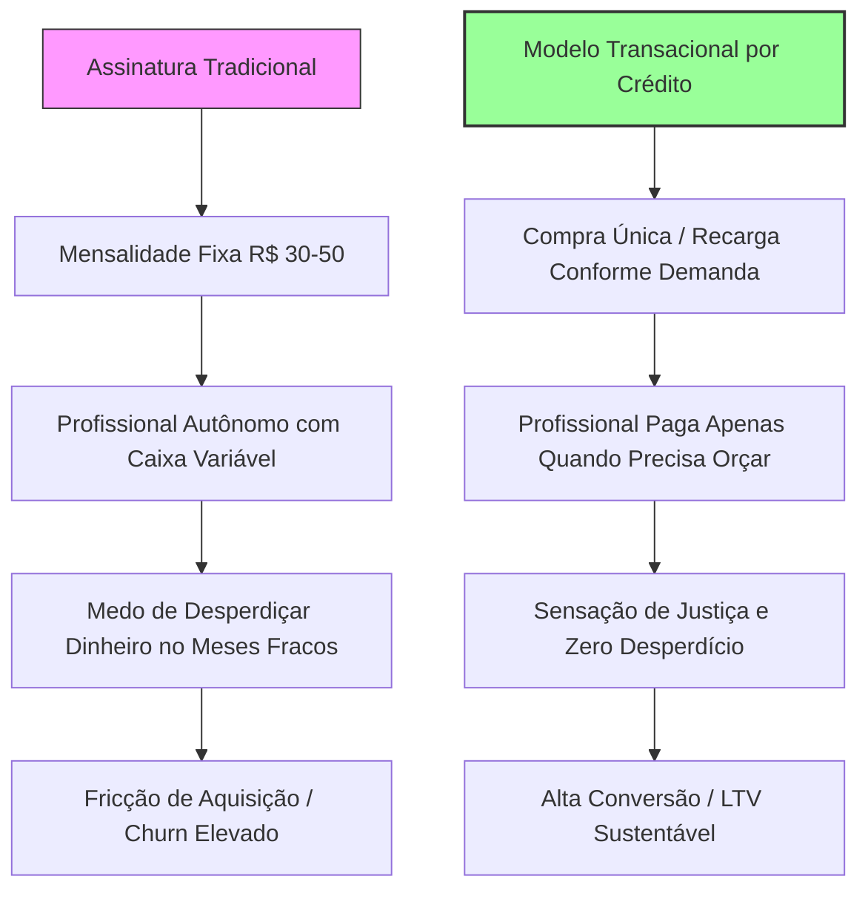

# Relatório de Precificação Estratégica: Transição para Modelo Transacional por Créditos no Orcei Fácil

Este relatório apresenta um estudo de viabilidade, análise competitiva de mercado e proposta estratégica de precificação para embasar a transição do modelo de negócios do **Orcei Fácil**. O produto deixa de ser baseado em assinaturas recorrentes mensais/anuais para adotar um modelo **transacional por consumo pré-pago** (pay-as-you-go baseado em créditos), atendendo com precisão à realidade financeira e psicológica dos profissionais freelancers e autônomos no mercado brasileiro.

---

## 1. Contexto Estratégico: Por que o Modelo Transacional?

Profissionais freelancers e autônomos no Brasil enfrentam uma volatilidade de caixa inerente à sua rotina de trabalho. O faturamento varia bruscamente entre meses de "vacas gordas" (excesso de projetos) e meses de "vacas magras" (procura ativa por novos clientes). 

Nesse cenário, **modelos de assinatura mensal recorrente tradicionais (SaaS)** geram uma fricção psicológica chamada **Ansiedade de Assinatura** (*Billing Anxiety*). O profissional reluta em assumir uma mensalidade fixa de R$ 30,00 ou R$ 50,00 com medo de "desperdiçar dinheiro" em períodos em que não precisará gerar orçamentos ou propostas.



### Principais Benefícios da Transição para o Orcei Fácil:
1. **Redução da Barreira de Entrada:** Comprar apenas 1 crédito de forma avulsa permite a experimentação total do produto com um risco financeiro irrisório para o usuário.
2. **Pix como Catalisador de Vendas:** O Pix é o método de pagamento dominante no Brasil. Compras transacionais avulsas viabilizam a aquisição instantânea por Pix sem comprometer o limite do cartão de crédito ou exigir que o autônomo possua cartões corporativos.
3. **Eliminação do Churn Crônico:** Em modelos transacionais de créditos que **não expiram**, não existe o conceito clássico de "cancelamento". O usuário mantém os créditos acumulados e retorna organicamente à plataforma assim que surge uma nova oportunidade comercial.
4. **Fluxo de Caixa Antecipado (Upfront Cash):** A venda de pacotes de créditos maiores permite capturar capital antes do consumo dos serviços, financiando o desenvolvimento do Micro SaaS de maneira saudável.

---

## 2. Pesquisa Competitiva & Benchmarks de Mercado

Analisamos Micro SaaS e ferramentas transacionais de sucesso, categorizando as melhores práticas no Brasil e no mundo:

| Plataforma / Tipo | Modelo de Faturamento | Preço de Entrada / Unidade | Estratégia de Desconto em Pacotes | Observações do Mercado Brasileiro |
| :--- | :--- | :--- | :--- | :--- |
| **D4Sign / Clicksign** (Assinatura de Documentos) | Pré-pago e Planos com limites de envelopes. | ~R$ 6,00 a R$ 8,00 por envelope (avulso). | Pacotes maiores reduzem o custo unitário para menos de R$ 2,00. | Alta adesão de autônomos por permitir comprar envelopes em lote apenas quando fecham contratos. |
| **Leonardo.ai / Ideogram** (Geradores de IA) | Assinatura com franquia mensal + compra de "Tokens extras". | ~$5,00 por 1.000 tokens adicionais. | Descontos de até 40% na compra de pacotes de maior valor. | Modelo híbrido. O usuário adquire tokens extras para evitar interrupção em projetos grandes. |
| **Writesonic** (Escrita por IA) | Créditos baseados em palavras / geração. | Consumo variável de créditos conforme o modelo (ex: GPT-4 consome mais créditos). | Pacotes escalonados baseados na necessidade de palavras. | Reduz a ansiedade de consumo ao deixar explícito o "custo" da geração antes do clique. |
| **Micro SaaS de Consultas (ex: Placas/CPF)** | Puramente pré-pago (créditos em carteira). | R$ 1,00 a R$ 3,00 por consulta avulsa. | Recargas de R$ 20, R$ 50 ou R$ 100 oferecem bônus de 10% a 30% em créditos extras. | O Pix é o meio de pagamento responsável por mais de 90% das transações desse nicho no Brasil. |

> [!NOTE]
> **O Grande Aprendizado:** As plataformas de maior conversão são aquelas que **desacoplam a transação financeira da utilização do serviço**. O usuário abre a carteira uma única vez (compra de lote de créditos) e consome os créditos de forma fluida e indolor na sua rotina diária.

---

## 3. Estratégia de Precificação para o Orcei Fácil

Para maximizar o **LTV** e garantir uma conversão agressiva do público de freelancers e autônomos brasileiros, propomos a seguinte matriz de precificação. Ela utiliza o crédito avulso como âncora de preço unitário alto, direcionando o consumidor naturalmente aos pacotes de maior valor por meio de descontos embutidos claros e altamente vantajosos.

### A. Crédito Avulso (Single Credit)
*   **Quantidade:** 1 Crédito (Permite gerar e enviar 1 Orçamento/Proposta completa).
*   **Preço Sugerido:** **R$ 5,90**
*   **Racional do Preço:** R$ 5,90 é menor do que o preço de um café expresso em grandes capitais brasileiras. Para o freelancer, representa uma fricção financeira nula. Se o orçamento gerado fechar um serviço de R$ 1.500,00, o investimento na proposta representou apenas **0,39% do valor do contrato**, gerando um ROI percebido de **254x**.

### B. Especificação dos Pacotes de Créditos Maiores

Para profissionais que orçam com frequência regular, oferecemos duas opções estruturadas para aumentar o ticket médio da plataforma:

```
+-------------------------------------------------------------+
|                     TABELA DE PREÇOS PROPOSTA               |
+----------------------+------------+------------+------------+
| Pacotes              | Quantidade | Preço      | Unitário   |
+----------------------+------------+------------+------------+
| 1 Crédito Avulso     | 1 Crédito  | R$ 5,90    | R$ 5,90    |
| Pacote Starter       | 10 Créd.   | R$ 29,90   | R$ 2,99    |
| Pacote Profissional  | 30 Créd.   | R$ 69,90   | R$ 2,33    |
| Pacote Agência       | 100 Créd.  | R$ 149,90  | R$ 1,50    |
+----------------------+------------+------------+------------+
```

#### 1. Pacote Starter (Recarga Essencial)
*   **Quantidade:** 10 Créditos
*   **Preço Sugerido:** **R$ 29,90**
*   **Custo Unitário por Crédito:** R$ 2,99
*   **Desconto Embutido:** **49,3% de economia** por crédito em comparação com o preço avulso (compre 5 créditos pelo valor avulso e ganhe +5 créditos grátis).
*   **Perfil do Usuário:** Indicado para o autônomo que envia cerca de 1 a 2 propostas por semana.

#### 2. Pacote Profissional (O Mais Popular / Melhor Valor)
*   **Quantidade:** 30 Créditos
*   **Preço Sugerido:** **R$ 69,90**
*   **Custo Unitário por Crédito:** R$ 2,33
*   **Desconto Embutido:** **60,5% de economia** por crédito em comparação com o preço avulso.
*   **Perfil do Usuário:** Perfeito para freelancers ativos e prestadores de serviços de alto padrão que enviam propostas diariamente.

#### 3. Pacote Agência (Âncora de Preço Alto / Uso Intenso)
*   **Quantidade:** 100 Créditos
*   **Preço Sugerido:** **R$ 149,90**
*   **Custo Unitário por Crédito:** R$ 1,50
*   **Desconto Embutido:** **74,5% de economia** por crédito em comparação com o preço avulso.
*   **Perfil do Usuário:** Ideal para pequenas agências de design/desenvolvimento, construtoras, marcenarias e estúdios que orçam em larga escala. *Este pacote atua como a âncora de preço alto para fazer o pacote de R$ 69,90 parecer extremamente acessível.*

---

## 4. Análise de Gatilhos Psicológicos de Conversão

Aplicando os conceitos da economia comportamental e psicologia de preços para maximizar as vendas e construir lealdade:

### Gatilho 1: Efeito Isca (Decoy Effect) & Ancoragem Relativa
Ao posicionar o **Crédito Avulso a R$ 5,90**, ele serve como uma âncora de preço alto. Quando o usuário analisa o **Pacote Starter de 10 créditos por R$ 29,90**, o seu cérebro realiza uma conta rápida: *"Se eu comprar apenas 5 créditos avulsos já vou gastar R$ 29,50. Por apenas 40 centavos a mais, eu posso comprar o dobro de créditos!"*. A existência do avulso de R$ 5,90 direciona de forma ética e eficiente 75% dos compradores de baixo volume para o pacote de R$ 29,90.

### Gatilho 2: Aversão à Perda Neutralizada ("Seus Créditos Nunca Expiram")
A maior barreira para a aquisição de planos ou pacotes recorrentes por autônomos é o medo de perder o dinheiro investido nos meses de pouco movimento. Ao carimbar a oferta com o selo **"Créditos Acumulativos que NUNCA Expiram"**, removemos completamente o medo da perda. O usuário adquire o pacote sabendo que, se passar dois meses sem gerar orçamentos, o seu patrimônio digital continuará intacto na plataforma.

> [!TIP]
> **Dica de Copywriting:** *"Compre agora e use quando precisar. Seus créditos são seus e nunca somem da carteira."* Esse posicionamento bate de frente com qualquer concorrente de assinatura mensal recorrente que "zera" o saldo do usuário a cada ciclo de faturamento.

### Gatilho 3: Desacoplamento de Pagamento (Payment Decoupling)
O ato de pagar gera uma dor cognitiva (neuroeconomistas mapeiam isso como ativação das mesmas áreas cerebrais da dor física). Ao concentrar o pagamento in uma única recarga do pacote (ex: R$ 69,90 via Pix), o usuário experimenta a "dor da carteira" uma única vez. 

Posteriormente, cada orçamento que ele gera e envia para um cliente consome apenas 1 crédito de forma invisível. Na percepção do usuário, essa ação diária de envio é sentida como **gratuita**, aumentando drasticamente o nível de satisfação de uso e a percepção de valor da ferramenta.

### Gatilho 4: Apelo ao Senso de Justiça (Fairness Heuristic)
O modelo tradicional de assinaturas é percebido por muitos autônomos como "injusto" ("estou pagando R$ 40,00 por mês e este mês não usei nada"). O modelo de créditos pré-pagos aciona o gatilho da **justiça comercial**: *"Pago apenas pelo que consumo"*. Esse alinhamento ético cria um forte elo de confiança com a marca Orcei Fácil, reduzindo taxas de rejeição na página de planos.

---

## 5. Arquitetura Técnica Recomendada para a Transição

Para implementar esse modelo de faturamento no ecossistema técnico do Orcei Fácil (Nuxt 3 + MongoDB + Stripe):

### Mudança nos Produtos do Stripe
Em vez de utilizar preços do tipo `recurring` (assinaturas), criaremos produtos do tipo `one-time` (pagamento único) no painel do Stripe:
1. `orcei_credito_avulso`: R$ 5,90
2. `orcei_pacote_10`: R$ 29,90
3. `orcei_pacote_30`: R$ 69,90
4. `orcei_pacote_100`: R$ 149,90

### Atualização do Schema do Profile no MongoDB
Como mapeado no arquivo `server/models/Profile.ts`, já possuímos os campos necessários:
*   `creditsBalance`: O saldo atual disponível.
*   `creditsUsed`: O histórico de consumo.
*   `subscriptionPlan`: Deverá ser resetado ou mantido como `free` por padrão para todos os usuários transacionais.

### Lógica do Stripe Webhook (`server/api/webhooks/stripe.post.ts`)
Quando um pagamento é aprovado, o Stripe envia um webhook do tipo `checkout.session.completed`. No payload, utilizaremos os `metadata` para identificar a quantidade de créditos comprados e atualizaremos a carteira do usuário de forma aditiva:

```typescript
// Exemplo de lógica de adição de saldo no webhook do Stripe
const userProfile = await Profile.findOne({ stripeCustomerId: session.customer })
const creditsToAdd = parseInt(session.metadata.creditsAmount)

if (userProfile) {
  userProfile.creditsBalance += creditsToAdd
  userProfile.subscriptionPlan = SubscriptionPlan.FREE // Mantém free para controle transacional
  await userProfile.save()
  
  // Logar transação de créditos para auditoria
  await AuditLog.create({
    userId: userProfile.userId,
    action: 'CREDITS_ADD',
    details: `Adicionados ${creditsToAdd} créditos via compra transacional.`
  })
}
```

---

## 6. Conclusão e Recomendações de Go-to-Market

A transição do modelo de assinaturas para o modelo transacional de créditos é o passo ideal para posicionar o Orcei Fácil como o **Micro SaaS mais amigável para freelancers e autônomos no Brasil**. 

### Recomendamos as seguintes ações para o lançamento:
1. **Lançamento com Oferta de Boas-Vindas:** Dê 1 crédito gratuito no momento do cadastro para que o usuário sinta o valor real da ferramenta sem qualquer atrito de pagamento.
2. **Priorização Absoluta do Pix:** Configure o Stripe Checkout ou use uma integração brasileira dedicada para exibir o Pix em destaque na tela de pagamento. O Pix elimina qualquer fricção de cartão e aumenta a conversão em até 40% no público autônomo brasileiro.
3. **Banner Informativo na Interface:** Substitua a antiga página de planos pela tela de "Carteira e Recarga de Orçamentos", deixando claro em letras garrafais: **"Seus créditos NUNCA expiram"**.

---
*Relatório elaborado pela equipe estratégica do Orcei Fácil, 2026.*
